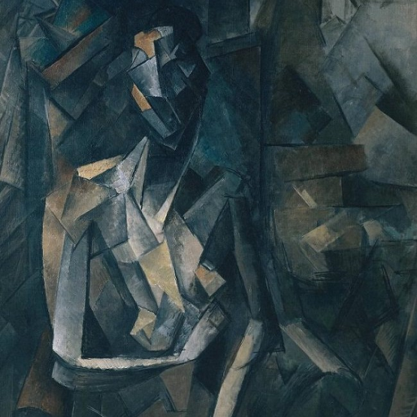

# CODECRAFT_GA_05
# Task 5 – Neural Style Transfer

## 👩‍💻 Description
This task applies the **artistic style of one image** (e.g., Van Gogh’s Starry Night) to the **content of another image** (e.g., a photo) using **Neural Style Transfer**.

## 🔧 Tools & Libraries
- Google Colab
- PyTorch
- TorchVision
- VGG19 Pre-trained Model
- Matplotlib, PIL

## 🖼️ Input Images
- **Content Image:** Girl with a violin
- **Style Image:** Abstract Picasso painting

## ✨ Output
The final output is a stylized image that blends the content of the photo with the style of the painting.

## 📂 Files
- `style_transfer.ipynb`: Colab notebook with full code
- `stylized_output.png`: Final stylized image

## ✅ Status
Completed Task 5 for CodeCraft Generative AI Internship ✨

